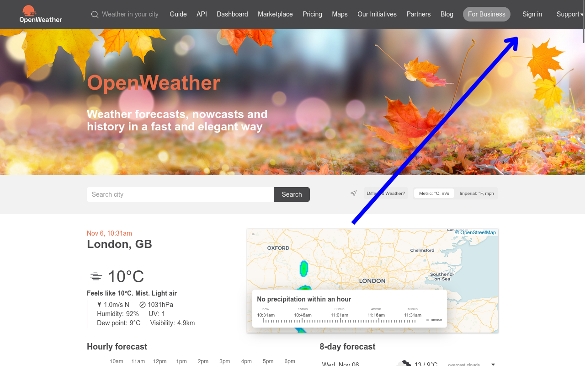
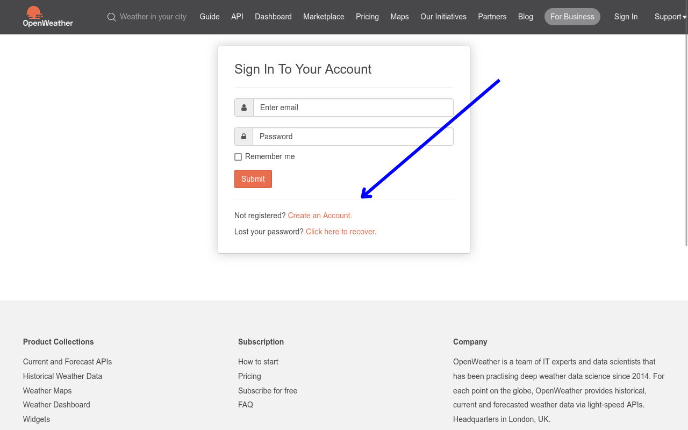
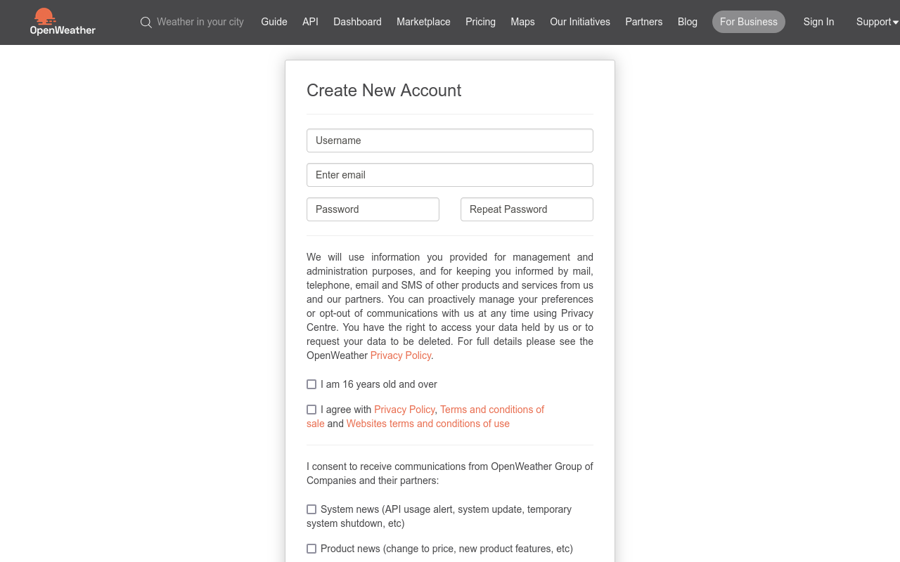
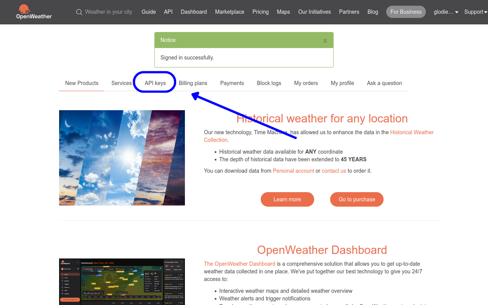
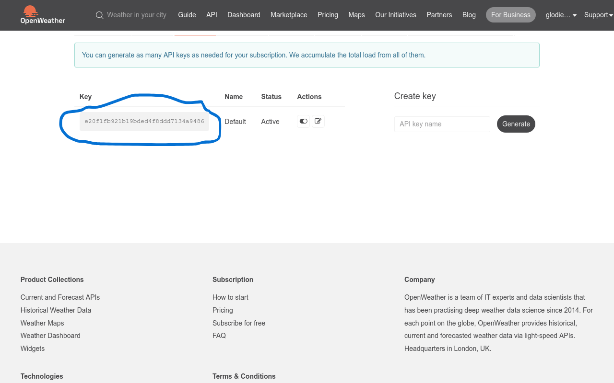

# Flask-API-Integration-Tutorial

**Description:**

Ce repository contient un tutoriel détaillé sur l'utilisation des données d'une API externe avec une application Flask. Vous y trouverez les étapes nécessaires pour configurer votre environnement, effectuer des requêtes à une API externe, traiter les données reçues et les intégrer dans votre application Flask.

**Contenu:**
- [Flask-API-Integration-Tutorial](#flask-api-integration-tutorial)
  - [Introduction à Flask](#introduction-à-flask)
  - [Configuration de L"environnement](#configuration-de-lenvironnement)
  - [Requêtes à une API externe](#requêtes-à-une-api-externe)
    - [Introduction à L'API OpenWeatherMap](#introduction-à-lapi-openweathermap)
    - [Creer un compte OpenWeatherMap](#creer-un-compte-openweathermap)
      - [Etape 1 :](#etape-1-)
      - [Etape 2:](#etape-2)
      - [Etape 3:](#etape-3)
      - [Etape 4:](#etape-4)
      - [Etape 5:](#etape-5)

**Prérequis:**
- Connaissances de base en Python
- Environnement de développement configuré

## Introduction à Flask
Flask est un micro-framework web en Python qui permet de développer des applications web de manière rapide et flexible. Il est conçu pour être léger et minimaliste, offrant les fonctionnalités essentielles pour créer des applications, comme le routage d'URL et la gestion des requêtes, tout en permettant aux développeurs de choisir leurs propres outils et bibliothèques pour des fonctionnalités avancées. Flask utilise le langage Python et est apprécié pour sa simplicité et sa modularité, ce qui le rend particulièrement adapté aux projets de petite à moyenne échelle ou aux prototypes.

## Configuration de L"environnement
Pour commencer on va devoir initialiser le projet sur notre machine et configurer notre environnemment pour ce faire je vous invite à suivre les étapes suivantes :

1. Creation du dossier qui va contenir notre application flask :
   ```bash
   mkdir Flask-API-Integration-Tutoriel
   ```
2. Initialisation d'un environnement virtuelle Python :
   ```bash
  python -m venv venv
   ```

   Pour ensuite activer l'environnemnt vituelle il faut taper la commande suivante :
   ```bash
   source venv/bin/activate
   ```

   une fois que l'environnement virtuelle à était configurer on va pouvoir installer les differentes dependance de notre projet 

3. Installation des differentes dépendances et librairies 
   Premierement nous aurons à installer notre dependace principale dans notre cas il s'agit de flask,

   ```bash 
   pip install flask
   ```

4. Verification des differentes fonctionnalité :
   on va crée un fichier `app.py`  dans lequel on va devoir mettre le contenu suivant :
   ```python
    from flask import Flask

    app = Flask(__name__)

    @app.route("/")
    def index():
      return "Hello World !"
   ```

   * `from flask import Flask` : cette ligne permet d'import `Flask` qui est une instances contenu dans flask qui permet de creer une instances de flask qui gère les routes et les requete web
   * `app = Flask(__name__)` : on initialise app comme étant une instance de flask. `Flask(__name__)` permet de à l'application de se reperer dans le dossier de notre projet
   * `@app.route("/")` : Ce Décorateur indique à Flaks quelle fonction il doit appeller lorsque, la route `/` est activé


   ensuite pour verifier si tout fonctionne correctement le mieux à faire serait de tester avec la commande suivante :
   ```bash
   flask run
   ```
## Requêtes à une API externe
### Introduction à L'API OpenWeatherMap
Il y a très peu d'API qui sont disponibles gratuitement, mais heureusement pour nous il y a une api qui nous propose un plan gratuit , il s'agit de `OpenWeatherMap API` cette api nous permet d'avoir acces à des donnée meteo de certaines regions de notre planete et c'est celle ci que nous allons utiliser pour notre exemple.

Malgres le fait qu'il soit gratuit cette api a quelque restriction : 
* elle ne nous permet que 60 appelles api par minute et 5000 par jour dans son plan gratuit
* pour l'utiliser la va falloir nécessairement créer un compte sur leur site web.
  
### Creer un compte OpenWeatherMap
pour creer un compte il va d'abord falloir se rendre sur le site web de OpenWeatherMap, elle se trouve sur l'addresse suivante :  [https://openweathermap.org/](https://openweathermap.org/)

#### Etape 1 :
Une fois que vous sur le site çà devrait se présente comme ça :
ensuite cliquer sur le button `Sign In`




#### Etape 2:
Ensuite vous devrait etre redirige sur une page qui ressemble un peu à ça : Si tu as un compte du doit juste remplir tes identifiants dans le formulaire, si non cliquer sur le button `Create an Account` pour cree un nouveau compte




#### Etape 3:
Si vous avez cclique sur ce button vous tomberez sur cette page, il faudrait ensuite remplir ce formulaire pour creer un nouveau compte :




#### Etape 4:
Une fois que tu te connectes ou que tu finis touce qui a rapport avec l'inscription, tu devrais etre rediriger vers cette page: 
Pour avoir acces aux donnée d'une api on a besoin d'une clé et c'est grace à cette clé que l'on a pouvoir avoir accees aux donnée que sert cette api et pour avoir notre clé il faut cliquez sur le button `Api Key`




#### Etape 5:
Copier cette clé Àpi on en aura besoin pour la suite :


