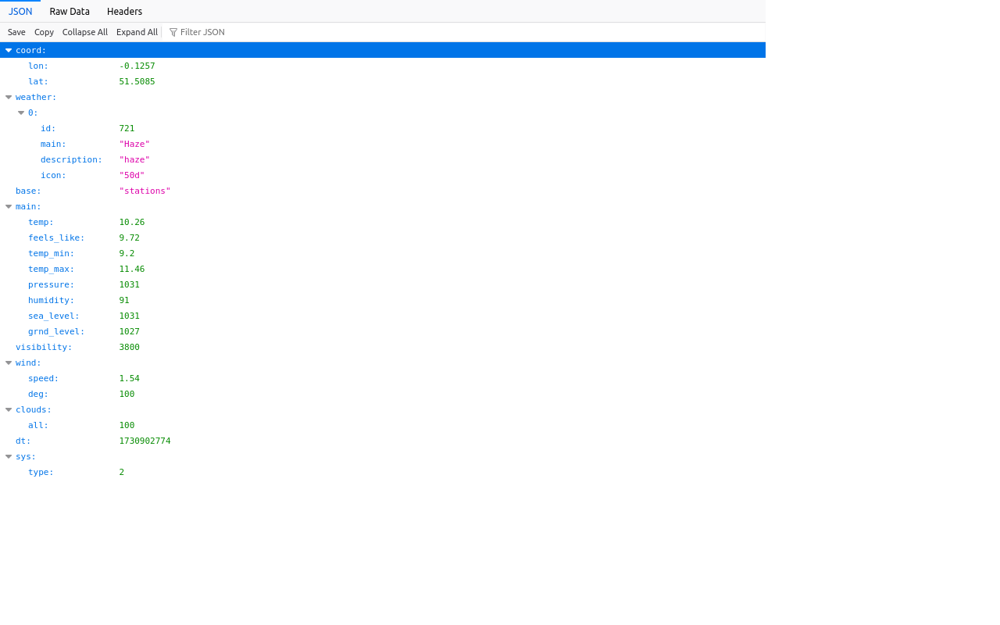
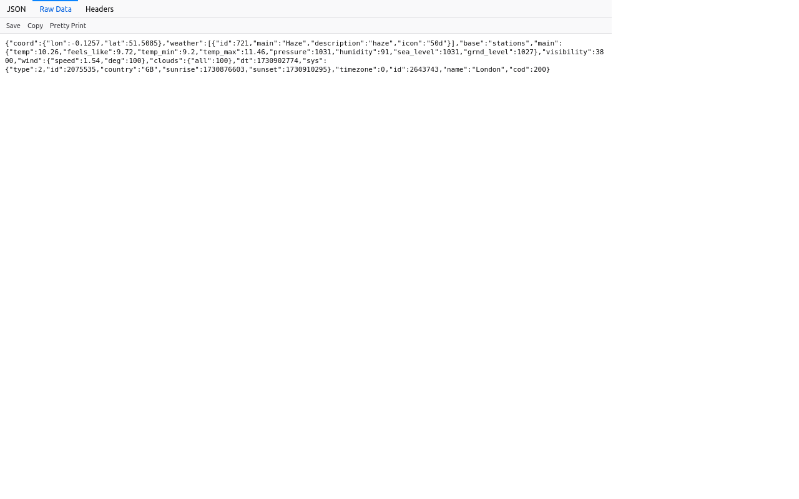

# Flask-API-Integration-Tutorial

**Description :**

Ce dépôt contient un tutoriel détaillé sur l'utilisation des données d'une API externe dans une application Flask. Vous y trouverez les étapes nécessaires pour configurer votre environnement, effectuer des requêtes vers une API externe, traiter les données reçues et les intégrer dans votre application Flask.

À la fin, vous construirez une application web qui récupère les données météorologiques d'une API et les affiche sur une page web.

**Contenu :**
- [Flask-API-Integration-Tutorial](#flask-api-integration-tutorial)
  - [Introduction à Flask](#introduction-à-flask)
  - [Configuration de l'environnement](#configuration-de-lenvironnement)
  - [Requêtes vers une API externe](#requêtes-vers-une-api-externe)
    - [Introduction à l'API OpenWeatherMap](#introduction-à-lapi-openweathermap)
    - [Création d'un compte OpenWeatherMap](#création-dun-compte-openweathermap)
      - [Étape 1 :](#étape-1-)
      - [Étape 2 :](#étape-2-)
      - [Étape 3 :](#étape-3-)
      - [Étape 4 :](#étape-4-)
      - [Étape 5 :](#étape-5-)
      - [Étape 6 :](#étape-6-)
    - [Analyse des fichiers JSON avec Python](#analyse-des-fichiers-json-avec-python)
      - [Introduction au JSON](#introduction-au-json)
      - [Extraction des informations de l'URL](#extraction-des-informations-de-lurl)
  - [Affichage des données dans l'application](#affichage-des-données-dans-lapplication)
    - [Étape 1](#étape-1)
    - [Étape 2](#étape-2)
    - [Étape 3](#étape-3)
  - [Aller plus loin](#aller-plus-loin)
  - [Conclusion](#conclusion)

**Prérequis :**
- Connaissances de base en Python
- Environnement de développement configuré

## Introduction à Flask
Flask est un micro-framework web en Python qui permet de développer des applications web de manière rapide et flexible. Il est conçu pour être léger et minimaliste, offrant les fonctionnalités essentielles pour créer des applications, comme le routage des URL et la gestion des requêtes, tout en permettant aux développeurs de choisir leurs propres outils et bibliothèques pour des fonctionnalités avancées. Flask utilise le langage Python et est apprécié pour sa simplicité et sa modularité, ce qui le rend particulièrement adapté aux projets de petite à moyenne échelle ou aux prototypes.

## Configuration de l'environnement
Pour commencer, nous allons initialiser le projet sur notre machine et configurer notre environnement en suivant les étapes suivantes :

1. Création du dossier qui contiendra notre application Flask :
   ```bash
   mkdir Flask-API-Integration-Tutorial
   ```

2. Initialisation d'un environnement virtuel Python :
   ```bash
   python -m venv venv
   ```

   Pour activer l'environnement virtuel, tapez la commande suivante :
   ```bash
   source venv/bin/activate
   ```

   Une fois l'environnement virtuel configuré, nous allons installer les dépendances nécessaires pour notre projet.

3. Installation des dépendances et bibliothèques :
   Tout d'abord, installons notre dépendance principale, Flask :
   ```bash 
   pip install flask
   ```

4. Vérification des fonctionnalités :
   Créons un fichier `app.py` avec le contenu suivant :
   ```python
   from flask import Flask

   app = Flask(__name__)

   @app.route("/")
   def index():
       return "Hello World !"
   ```

   - `from flask import Flask` : Cette ligne permet d'importer `Flask`, le framework web.
   - `app = Flask(__name__)` : On initialise `app` comme instance de Flask. `Flask(__name__)` permet à l'application de se repérer dans le dossier de notre projet.
   - `@app.route("/")` : Ce décorateur indique à Flask d'appeler cette fonction lorsque la route `/` est activée.

   Pour tester si tout fonctionne correctement, lancez la commande suivante :
   ```bash
   flask run
   ```

## Requêtes vers une API externe
### Introduction à l'API OpenWeatherMap
OpenWeatherMap propose une API gratuite qui permet d'accéder aux données météorologiques de certaines régions de notre planète, et c'est celle que nous allons utiliser pour cet exemple.

Elle impose quelques restrictions :
- 60 appels API par minute et 5000 par jour dans son plan gratuit.
- La création d'un compte est nécessaire pour l'utiliser.

### Création d'un compte OpenWeatherMap
Pour créer un compte, rendez-vous sur le site OpenWeatherMap à l'adresse suivante : [https://openweathermap.org/](https://openweathermap.org/).

#### Étape 1 :
Une fois sur le site, cliquez sur le bouton `Sign In`.


#### Étape 2 :
Si vous n'avez pas encore de compte, cliquez sur `Create an Account` pour en créer un.


#### Étape 3 :
Remplissez le formulaire pour créer votre compte.


#### Étape 4 :
Connectez-vous, puis cliquez sur `API Key` pour obtenir votre clé API, nécessaire pour accéder aux données.


#### Étape 5 :
Copiez cette clé API pour l'utiliser dans la suite du tutoriel.


#### Étape 6 :
Essayez d'ouvrir l'URL suivante dans votre navigateur, en remplaçant `<API Key>` par votre clé API :  
`http://api.openweathermap.org/data/2.5/weather?q=London,uk&units=metric&appid=<API Key>`

Vous devriez obtenir un résultat comme suit :



### Analyse des fichiers JSON avec Python
Maintenant que nous pouvons accéder aux données via HTTP et l'URL de l'API, voyons comment les utiliser dans du code Python.

#### Introduction au JSON
Le JSON est une structure de données similaire aux dictionnaires Python, ce qui facilite son utilisation. Python dispose de bibliothèques pour traiter le JSON depuis une URL :
- `urllib` : Permet de télécharger les données contenues dans l'URL.
- `json` : Permet de parser les données JSON en un dictionnaire Python.

Ces deux bibliothèques sont intégrées à Python et n'ont donc pas besoin d'être installées.

#### Extraction des informations de l'URL
Pour commencer, importons les bibliothèques nécessaires :
```python
import json
import urllib
```

Ensuite, créons la fonction pour récupérer les données :
```python
def get_weather(query):
    api_url = "http://api.openweathermap.org/data/2.5/weather?q={}&units=metric&appid=<API Key>"
    query = urllib.parse.quote(query)
    url = api_url.format(query)
    data = urllib.request.urlopen(url).read()
    parsed = json.loads(data)
    weather = None
    
    if 'weather' in parsed:
        weather = {
            'description': parsed['weather'][0]['description'],
            'temperature': parsed['main']['temp'],
            'city': parsed['name'],
            'country': parsed['sys']['country']
        }
    
    return weather
```

- `query = urllib.parse.quote(query)`: Cette ligne convertit `query` en un format compatible URL.
- `url = api_url.format(query)`: `format()` permet de substituer `{}` par `query` dans l'URL.
- `data = urllib.request.urlopen(url).read()`: Télécharge les données de l'URL.
- `parsed = json.loads(data)`: Convertit les données JSON de l'API en un dictionnaire Python.

N'oubliez pas de remplacer `<API Key>` par votre clé API.

## Affichage des données dans l'application

Maintenant que nous sommes capables de récupérer les données de l'API sous forme de dictionnaire Python, nous devrions pouvoir les afficher dans une page web HTML. Pour cela, nous allons utiliser le moteur de template Jinja.

Jinja est un moteur de templates utilisé dans le développement web, surtout avec le framework Flask. Il permet de générer des pages HTML dynamiques en mélangeant du code HTML avec des variables et des expressions Python. En gros, Jinja agit comme un "intermédiaire" qui intègre les données Python dans les pages HTML.

Et comme Jinja est déjà intégré dans Flask, nous n'avons pas besoin de l'installer dans notre environnement. Les étapes suivantes vous montreront comment utiliser Jinja pour notre projet.

### Étape 1
Pour commencer, créez un dossier dans notre projet nommé `templates`, puis, dans ce dossier, créez un fichier `.html` nommé `home.html` qui contiendra le code suivant :

```html
<!DOCTYPE html>
<html lang="en">
<head>
  <meta charset="UTF-8">
  <meta http-equiv="X-UA-Compatible" content="IE=edge">
  <meta name="viewport" content="width=device-width, initial-scale=1.0">
  <title>Weather</title>
</head>
<body>
  
</body>
</html>
```

**NB** : Il est important que le dossier contenant nos fichiers `.html` s'appelle `templates` pour qu'il soit reconnu par Jinja.

### Étape 2
Ensuite, nous devons faire en sorte qu'à chaque lancement du serveur, notre page web soit affichée. Rendez-vous dans le fichier `app.py` et importez une fonction de Flask qui nous permettra de le faire :

```python
from flask import Flask, render_template
```

Modifiez ensuite la fonction `index` pour qu'elle renvoie notre page HTML :

```python
def index():
    return render_template("home.html")
```

Une fois le serveur lancé, vous devriez obtenir le résultat suivant :


Ceci étant fait, notre objectif reste tout de même de pouvoir visualiser nos données sur notre page. Pour cela, passons à la dernière étape :

### Étape 3
Pour que nos données soient accessibles sur notre page, nous devons les passer comme arguments à la fonction `render_template` :

```python
def index():
    return render_template(
        "home.html",
        weather=get_weather("London,Uk")
    )
```

* La fonction `render_template` dans Flask permet de générer une page HTML en utilisant un template Jinja et de l’envoyer en réponse au client (navigateur). Elle fait deux choses principales

Nous pouvons maintenant accéder à nos données sur notre page web. Il ne reste plus qu'à bien les organiser :

```html
<html lang="en">
<head>
  <meta charset="UTF-8">
  <meta http-equiv="X-UA-Compatible" content="IE=edge">
  <meta name="viewport" content="width=device-width, initial-scale=1.0">
  <title>Weather</title>
</head>
<body>
  <h1>Weather</h1>
  <h2>Current Weather</h2>
  <p>
    City: 
    <b>{{ weather.city }} | {{ weather.country }}</b>
  </p>
  <p>{{ weather.description }} | {{ weather.temperature }}&#8451;</p>
</body>
</html>
```

Si vous redémarrez le serveur, votre page web devrait ressembler à ceci :


## Aller plus loin

Pour aller plus loin, vous pouvez permettre aux utilisateurs de rechercher une ville spécifique :
On va mettre à la disposition des utilisateurs un formulaire qui leur permettra de saisir les villes qu'ils souhaitent, puis nous récupérerons les informations saisies pour effectuer des requêtes API afin de récupérer les données météo de la ville choisie par l'utilisateur.

Dans `home.html` :
```html
<form>
  <input type="text" name="city" id="city" placeholder="Search">
  <input type="submit" value="Submit">
</form>
```

Pour récupérer les requêtes faites par un formulaire HTML, Flask met à notre disposition la fonction `request`. Nous allons donc devoir l'importer.

Dans `app.py` :
```python
from flask import Flask, render_template, request
```

```python
def index():
    city = request.args.get('city')
    if not city:
        city = "London,Uk"

    return render_template(
        "home.html",
        weather=get_weather(city)
    )
```

* `city = request.args.get('city')` : `request.args.get('city')` permet de récupérer la requête entrée dans le formulaire. Nous stockons ensuite ces informations dans la variable `city`.


## Conclusion

Dans ce tutoriel, nous avons exploré comment intégrer et afficher des données d'une API dans une application Flask. En suivant chaque étape, nous avons :

1. Récupéré des données via une API et les avons traitées sous forme de dictionnaire Python.
2. Utilisé Jinja pour afficher ces données dynamiquement dans une page HTML.
3. Créé un formulaire pour permettre aux utilisateurs de rechercher des informations en fonction de leurs besoins.

En maîtrisant ces bases, vous êtes désormais en mesure de créer des interfaces interactives et personnalisées pour vos utilisateurs, en affichant des informations dynamiques et en les organisant de manière claire.

**Pour aller plus loin :** vous pourriez explorer l'ajout de CSS et JavaScript pour styliser et améliorer l'expérience utilisateur, ou même ajouter des fonctionnalités de cache pour rendre l'application plus performante. 